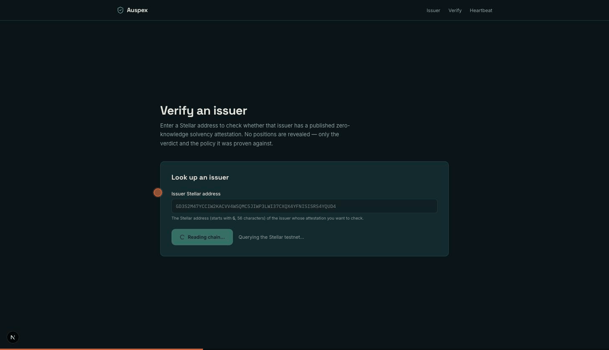
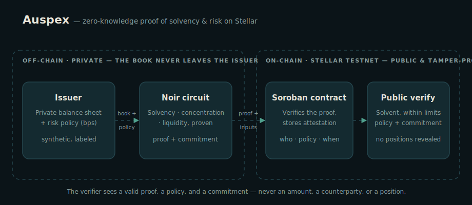

<h1 align="center">Auspex</h1>

<p align="center"><b>Prove you're solvent — without opening your books.</b></p>

<p align="center">
Zero-knowledge proof of solvency &amp; risk attestation on <a href="https://stellar.org">Stellar</a>.
A financial institution proves, in zero-knowledge, that it is solvent and within defined risk limits —
without revealing a single position, counterparty, or amount. The proof is verified on-chain in a Soroban
contract; anyone can check the result in seconds, and no one can forge a passing one.
</p>

<p align="center"></p>

<p align="center"><em>Public verification: a verdict and the policy proven — the balance sheet stays sealed.</em></p>

<p align="center"></p>

---

## What it is

*Auspex* was the Roman augur who read sealed signs and pronounced a verdict — without revealing the entrails. A zero-knowledge proof is the modern auspex: it pronounces **"solvent, within limits"** from a sealed proof, the books never opened.

An off-chain **Noir** circuit produces a succinct proof over the institution's private balance sheet. A **Soroban** smart contract verifies that proof on-chain and records a public, tamper-proof **attestation** — *who, what policy, when*, never the numbers. The zero-knowledge proof is not decorative; it **is** the product: a false "solvent" claim is cryptographically impossible to publish.

## Why

Post-FTX, institutions are expected to prove solvency — but the two existing options are both bad:

- **Full disclosure** (publish the book) leaks trading strategy, client identities, and commercial relationships. No serious institution will do it.
- **"Trust me / trust my auditor"** (a PDF, a signed letter, a Merkle "proof of reserves") is a snapshot of *liabilities* that says nothing about **risk** — concentration in one counterparty, illiquid assets dressed up as reserves — and has repeatedly failed.

Auspex proves *"I am solvent **and** I am not taking reckless risks"* in a way that is simultaneously **private** (the book stays secret), **trustless** (no auditor to bribe), and **publicly verifiable** (on-chain, in seconds).

## How it works

The circuit proves three properties over the **private** book against a **public** policy:

| Constraint | The circuit proves… |
|---|---|
| **Solvency** | total assets ≥ liabilities × a safety buffer (`buffer_bps`) |
| **Concentration** | no single counterparty exceeds `max_concentration_bps` of assets |
| **Liquidity** | liquid assets are at least `min_liquidity_bps` of total |

The proof is bound to a Pedersen **commitment** of the exact book (`commitment = pedersen_hash([amounts ‖ counterparty_ids ‖ is_liquid ‖ active ‖ liabilities ‖ salt])`). The contract verifies the proof on-chain and decodes the public inputs — `[commitment, buffer_bps, max_concentration_bps, min_liquidity_bps]`, four 32-byte big-endian field elements — then stores the attestation. The public sees the verdict and the policy; never a magnitude.

Three pieces:

- **`circuits/solvency`** — the Noir circuit (`N=64` positions, `K=16` counterparties; proof 14,592 B, public inputs 128 B).
- **`contracts/auspex`** — the Soroban contract: `attest(issuer, proof, public_inputs) -> id`, plus read methods `get_latest` / `get_attestation` / `count`. It reuses a vendored UltraHonk verifier.
- **`cli/`** + **`web/`** — the glue and the surfaces: issue + publish, public verify, a **solvency-heartbeat** timeline, and an **auditor view-key** for selective disclosure.

## The load-bearing property (the cheat demo)

If a book violates the policy — say 80% of assets in one counterparty against a 50% limit — the circuit is **unsatisfiable** and **no valid proof exists**. The issuer therefore *cannot* publish a passing attestation it did not earn. See it for yourself:

```bash
bash scripts/demo_cheat.sh
# → Assertion failed: concentration: counterparty exposure exceeds limit
# → EXPECTED: proof generation failed — the circuit refuses to attest a non-compliant book.
```

## Quickstart

**Prerequisites:** [`nargo`](https://noir-lang.org) `1.0.0-beta.9` · [`bb`](https://github.com/AztecProtocol/aztec-packages/tree/master/barretenberg) `0.87.0` · [`stellar`](https://developers.stellar.org/docs/tools/cli) CLI · [`just`](https://github.com/casey/just) · Node 24 · pnpm. The CLI signs with a funded testnet account via `AUSPEX_SECRET` (e.g. the harness `alice` identity: `stellar keys secret alice`).

```bash
# 1. Build the CLI
pnpm --dir cli install && pnpm --dir cli build

# 2. Generate a proof for a (synthetic) book + policy
node cli/dist/index.js prove \
  --book fixtures/healthy.book.json --policy fixtures/healthy.policy.json

# 3. Publish it on-chain (testnet)
AUSPEX_SECRET=$(stellar keys secret alice) \
  node cli/dist/index.js publish --proof circuits/solvency/target --network testnet

# 4. Anyone verifies it (read-only, no secret)
node cli/dist/index.js verify --issuer <ISSUER_ADDRESS> --network testnet

# 5. (Optional) Selective disclosure — prove with `--view-key out.json` to retain
#    the private {book, salt}; a designated auditor then re-derives the commitment
#    and sees the full book, while the public still sees only the verdict:
node cli/dist/index.js audit --view-key out.json --issuer <ISSUER_ADDRESS> --network testnet
```

**Web app** (issuer + public verify surfaces):

```bash
cd web && pnpm install
AUSPEX_SECRET=$(stellar keys secret alice) pnpm dev   # http://localhost:3000
```

The book is processed **server-side only** and never leaves the machine; only the proof and the attestation are published. Three surfaces: **issue & publish**, **public verify**, and a **solvency heartbeat** that traces an issuer's attestations over time. See [`web/README.md`](web/README.md) for details.

## Live on testnet

- **Contract:** [`CDCPPCTTPAOHPV5UOMVWD4SPVLMGQOEAPLZ7QL2H44OA6IKGVE2LZZWB`](https://stellar.expert/explorer/testnet/contract/CDCPPCTTPAOHPV5UOMVWD4SPVLMGQOEAPLZ7QL2H44OA6IKGVE2LZZWB)
- Attestations have been issued, verified on-chain, and read back via both the CLI and the web app. The verify surface shows the verdict, the policy proven, and the commitment — and renders the private book as a sealed, redacted ledger: *no positions revealed.*

## Honesty &amp; limitations

This honesty is deliberate — an honest work-in-progress over a polished mystery:

- All balance-sheet data in the demo is **synthetic and labeled as such** (`fixtures/*.book.json`).
- Auspex proves that **the committed book satisfies the policy**, and binds the proof to that commitment. It does **not**, in v1, prove the committed book matches an institution's *real-world* custody. Tying the commitment to reality (signed custody feeds, MPC over bank/chain balances, oracle attestations) is **explicit future work**, not claimed as done.
- The proof attests policy **ratios** over the committed book; it does not reveal magnitudes, so a deliberately small book can satisfy them. The circuit guards only the degenerate empty book (`total_assets > 0`).
- Commitment **hiding** depends on a high-entropy `salt` supplied by the prover (the CLI generates it with a CSPRNG); a predictable salt over a low-entropy book would weaken confidentiality.
- v1 runs on **testnet only**; no real funds, no production key management.

## Repository layout

```
auspex/
  circuits/solvency/      # Noir circuit (the proof)
  circuits/commitment/    # helper circuit — derives the Pedersen commitment for the CLI
  contracts/auspex/       # Soroban contract: verify-then-attest + read methods
  crates/                 # vendored UltraHonk Soroban verifier harness (own license)
  cli/                    # TypeScript CLI: prove / publish / verify / audit (view-key)
  web/                    # Next.js app: issuer + public verify + solvency heartbeat
  fixtures/               # synthetic books + policies (labeled)
  scripts/demo_cheat.sh   # the load-bearing cheat-attempt demo
  SPEC.md · PLAN.md       # the design spec and the build plan
```

## License

[MIT](LICENSE). The vendored verifier under `crates/` retains its own upstream license and attribution.
